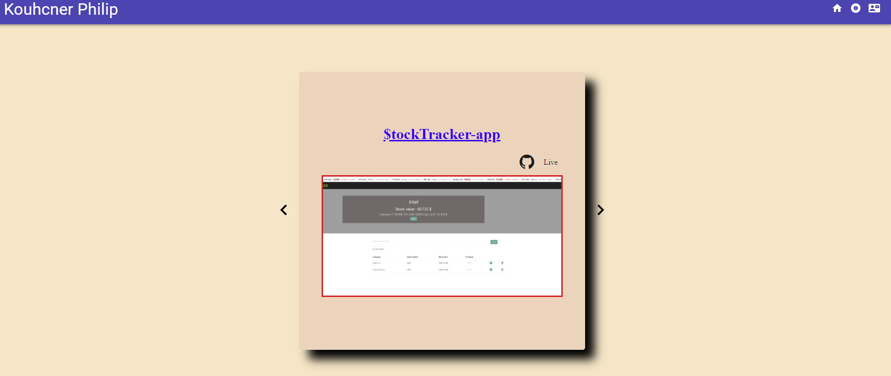

  [](https://shields.io/)
[](https://shields.io/)
  
  
# Introduction: React Portfolio

Now that you've worked with React and have multiple projects to share, you'll be updating your portfolio and other materials to build toward being employer competitive. Creating a portfolio using React will help set you apart from other developers whose portfolios do not use some of the latest technologies.
Part of being a web developer means being a part of a community.
## User Story

```
As a user, I want to create a my portfolio using React.

```

## Screenshot



## Getting Started

### `npm start`

Runs the app in the development mode.<br />
Open [http://localhost:3000](http://localhost:3000) to view it in the browser.

The page will reload if you make edits.<br />
You will also see any lint errors in the console.

### `npm run build`

Builds the app for production to the `build` folder.<br />
It correctly bundles React in production mode and optimizes the build for the best performance.

The build is minified and the filenames include the hashes.<br />
Your app is ready to be deployed!

See the section about [deployment](https://facebook.github.io/create-react-app/docs/deployment) for more information.

### Prerequisites

Visual Studio Code / Sublime Text.

## Built With

- React
- CSS
- JavaScript
- Material UI - https://material-ui.com/ 

## Authors

- Philip Kouchner
- Github link - https://philipk-webdev.github.io/React_Portfolio/


